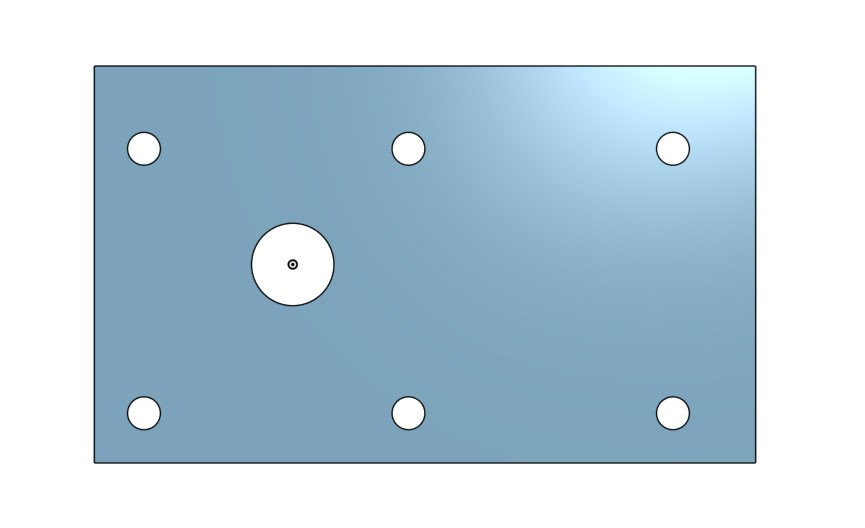
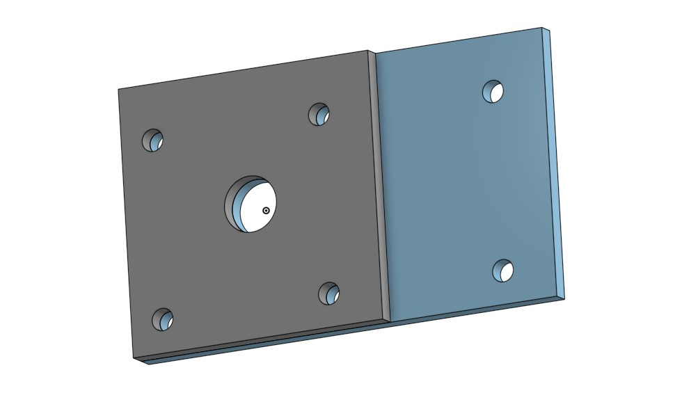
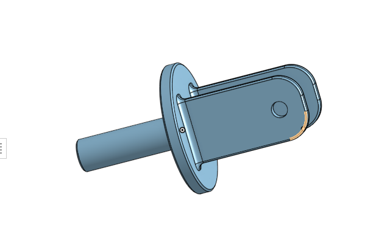
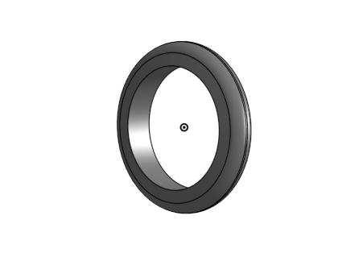
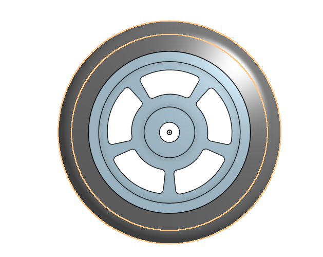

# BasicCAD

We are creating a caster.

---
## Table of Contents
* [Table of Contents](#Table-of-Contents)
* [Base](#Base)
* [Mount](#Mount)
* [Fork](#Fork)
* [Tire](#Tire)
* [Wheel](#Wheel)
* [AxleCollarBearings](#AxleCollarBearings)

## Base

### Description

The first assignment is to create the caster base.  The base's dimensions are 200 mm x 120 mm and 8 mm thick.  It has 6 holes 10 mm wide and 20 mm from the edge equally spaced along the edges.

### Evidence
[The Base in Onshape](https://cvilleschools.onshape.com/documents/ad830a070c8864515bea5727/w/46c209c91d6893be1e034a87/e/d90b0d9af8472364d37af5c1)

### Image

### Reflection

This was my first Onshape part and [following along with Dr. Shields made it super easy.](https://www.youtube.com/watch?v=93BFUD-HAG8&feature=emb_title&scrlybrkr=5670f0b4)  I learned about 
* sketching (shortcut **shift-s**)
* constructions lines (shortcut **Q**)
* dimensions (shortcut **D**)
* extruding both add and remove (shortcut key **E**)
* linear patterns (no shortcut)
* very easy to understand

Onshape is awesome.  I found it really helpful to rename all my sketches.  It is going to be a GREAT year in engineering.

---

## Mount

### Description

Mount for the Base.

### Evidence

[Onshape Mount](https://cvilleschools.onshape.com/documents/ad830a070c8864515bea5727/w/46c209c91d6893be1e034a87/e/d90b0d9af8472364d37af5c1)
### Image

### Reflection

* very simple to understand
* you didn't need to make new part which was nice.
* vertical line (shortcut v)
* variables (change the thickness of parts)

## Fork

### Description

Fork for the caster.

### Evidence

[Fork](https://cvilleschools.onshape.com/documents/c33819194e8790a5560da215/w/8269aa8635eb372a81d2192e/e/ff6cce621dbb8dcfe0872723)

### Image

### Reflection

It was simple like the rest, but It was a little challenging. It introduced stuff that I didn't know about.
* chamfer 
* concentric
* Fillet

---

## Tire

### Description

Tire for the caster.

### Evidence
[Tire](https://cvilleschools.onshape.com/documents/37551a83ff299fcf33109f29/w/462db124c24d3edf044838d1/e/061ce9e6299f15d6be461984)

### Image

### Reflection

It was pretty fun and it was very different from the last parts.
* used lined instead of shape sketches
* used revolve instead of extrude
* very simple and enjoyable

---

## Wheel

### Description

Wheel for the caster.

### Evidence

[Wheel](https://cvilleschools.onshape.com/documents/37551a83ff299fcf33109f29/w/462db124c24d3edf044838d1/e/061ce9e6299f15d6be461984)

### Image

### Reflection

* pretty simple since there's a tutorial
* tricky at the begenning 
* messed up by sketching on the wrong plane 
* corrected myself by doing it on the correct plane

---

## AxleCollarBearings

### Description

### Evidence

### Image

### Reflection

---
